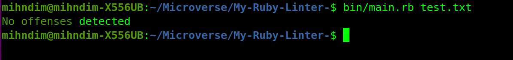
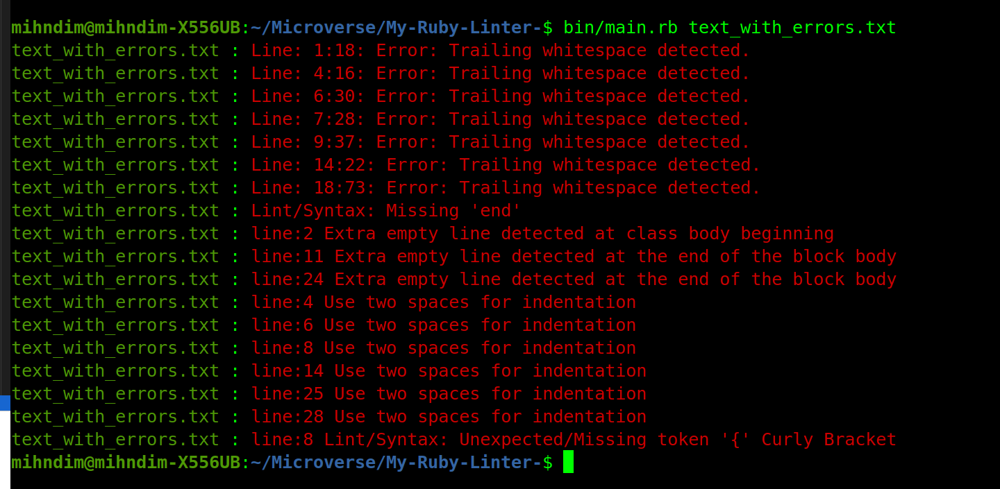
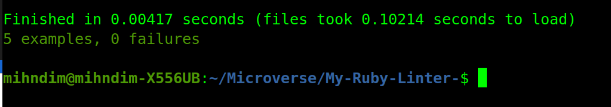

# Ruby Capstone Project: My-Ruby-Linters

> In this project, I have build Linters for Ruby programs which parses the code base and returns a feedback concerning the indentation, trailing white spaces, tag errors, end errors and line errors.

Additional description about the project and its features.

## Built With

- Ruby Programming Language 
- RSpec for writing tests

## Getting Started
- To run the program on your local machine, follow the steps below

### Prerequisites
- Laptop with an operating system installed
- Access to the internet
- Install Ruby Programming Language(Ruby v 2.7.0)
- Install gem colorized

### Usage
- Clone this repository to your local machine by the entering this command on your terminal: git clone https://github.com/Mihndim2020/My-Ruby-Linter-/tree/my_linters
- cd into to the folder 
- enter bin/main.rb --file-path to check your source code for linter errors. 

### Testing with RSpec
This project is tested with Rspec which is a computer domain-specific language (DSL) testing tool written in the Ruby programming language

## Authors

👤 **Author1**

- GitHub: [@mihdim2020](https://github.com/@mihdim2020)
- Twitter: [ @mihndim](https://twitter.com/@mihndim)
- LinkedIn: [ Mih Julius](https://linkedin.com/Mih Julius)

## 🤝 Contributing

Contributions, issues, and feature requests are welcome!

Feel free to check the [issues page](issues/).

## Show your support

Give a ⭐️ if you like this project!

## Acknowledgments

- Microverse community
- Standup team

## 📝 License

MIT License

Copyright (c) 2021 Mihndim Julius

Permission is hereby granted, free of charge, to any person obtaining a copy
of this software and associated documentation files (the "Software"), to deal
in the Software without restriction, including without limitation the rights
to use, copy, modify, merge, publish, distribute, sublicense, and/or sell
copies of the Software, and to permit persons to whom the Software is
furnished to do so, subject to the following conditions:

The above copyright notice and this permission notice shall be included in all
copies or substantial portions of the Software.

THE SOFTWARE IS PROVIDED "AS IS", WITHOUT WARRANTY OF ANY KIND, EXPRESS OR
IMPLIED, INCLUDING BUT NOT LIMITED TO THE WARRANTIES OF MERCHANTABILITY,
FITNESS FOR A PARTICULAR PURPOSE AND NONINFRINGEMENT. IN NO EVENT SHALL THE
AUTHORS OR COPYRIGHT HOLDERS BE LIABLE FOR ANY CLAIM, DAMAGES OR OTHER
LIABILITY, WHETHER IN AN ACTION OF CONTRACT, TORT OR OTHERWISE, ARISING FROM,
OUT OF OR IN CONNECTION WITH THE SOFTWARE OR THE USE OR OTHER DEALINGS IN THE
SOFTWARE.
